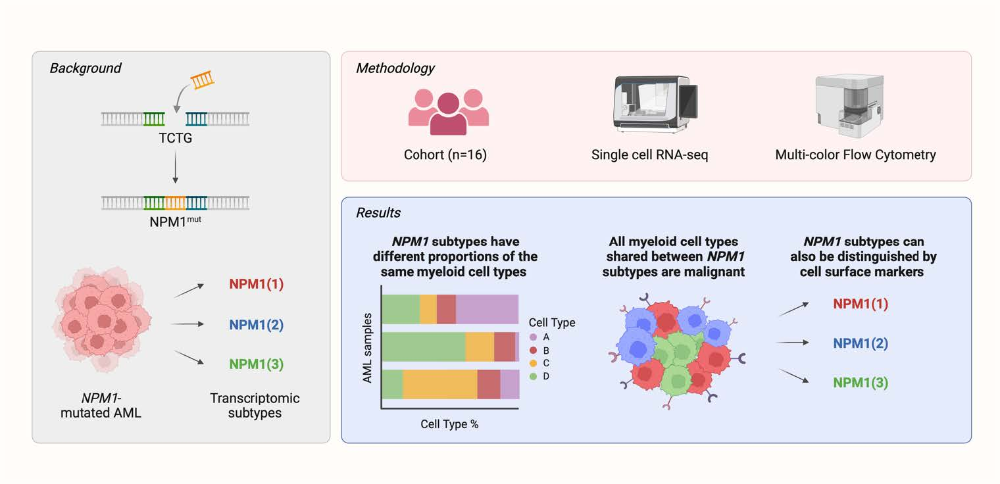

# Graphical Abstract

# Abstract

NPM1-mutated AML is one of the largest entities in international classification systems of myeloid neoplasms, which are based on integrating morphologic and clinical data with genomic data. Previous research, however, indicates that bulk transcriptomics-based subtyping may improve prognostication and therapy guidance. Here, we characterized the heterogeneity in NPM1-mutated AML by performing single-cell RNA-sequencing and spectral flow cytometry on 16 AML belonging to three distinct subtypes previously identified by bulk transcriptomics. Using single-cell expression profiling we generated a comprehensive atlas of NPM1-mutated AML, collectively reconstituting complete myelopoiesis. The three NPM1-mutated transcriptional subtypes showed consistent differences in the proportions of myeloid cell clusters with distinct patterns in lineage commitment and maturational arrest. In all samples, malignant cells were detected across different myeloid cell clusters, indicating that NPM1-mutated AML are heavily skewed but not fully arrested in myelopoiesis. Same-sample multi-color spectral flow cytometry recapitulated these skewing patterns, indicating that the three NPM1-mutated subtypes can be consistently identified across platforms. Moreover, our analyses highlighted differences in the abundance of rare hematopoietic stem cells suggesting that skewing occurs early in myelopoiesis. To conclude, by harnessing single-cell RNA-sequencing and spectral flow cytometry, we provide a detailed description of three distinct and reproducible patterns in lineage skewing in NPM1-mutated AML that may have potential relevance for prognosis and treatment of patients with NPM1-mutated AML.

# Code

We are currently refactoring the code to re-anonymize the patient data according to new European data protection regulations.

# Data

Processed Seurat objects are available under DOI: [10.6084/m9.figshare.26189771](https://doi.org/10.6084/m9.figshare.26189771).

# License

All code is licensed under the GPL-3.0 license.
